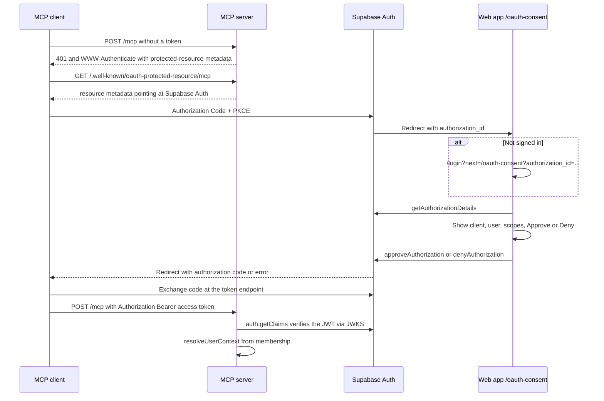

# Authentication

MCP clients sign in as existing SaaS users. Supabase Auth is the OAuth 2.1 authorization server (Authorization Code + PKCE). This app does not implement its own token endpoint.

The web app shows the consent screen. The MCP server is only a resource server: it publishes discovery metadata and checks the access token on `/mcp`.

## One-time Supabase dashboard setup

In the Supabase project (Authentication):

1. **URL Configuration → Site URL:** `http://localhost:3000` for local dev (the Next.js app).
2. **OAuth Server:** enable the OAuth 2.1 server.
3. **Authorization Path:** `/oauth-consent`. Supabase joins this with the Site URL and redirects the browser to `http://localhost:3000/oauth-consent?authorization_id=...`.
4. **Dynamic client registration** (optional): turn this on if MCP clients such as Cursor should register themselves. Leave it off and register a client manually if you want a fixed client id.

Discovery for MCP clients lives on the Supabase project, not in this repo:

`https://<project-ref>.supabase.co/.well-known/oauth-authorization-server/auth/v1`

The MCP process fetches that document at startup and republishes it for legacy clients that look at the MCP origin. If the OAuth server is not enabled yet, discovery returns 404. The process still starts and advertises Supabase’s standard authorize and token URLs. Turn the server on in the dashboard, then restart the MCP process so clients receive the live document (including the registration endpoint when dynamic client registration is enabled).

## End-to-end flow

What each step uses:

| Step                                | Who                                       | Library                                                                      |
| ----------------------------------- | ----------------------------------------- | ---------------------------------------------------------------------------- |
| Consent details, approve, deny      | `apps/web` `/oauth-consent`               | `supabase.auth.oauth`                                                        |
| Login if the browser has no session | existing `/login`, `next` query preserved | `@supabase/ssr`                                                              |
| 401 challenge and discovery routes  | `apps/mcp-server`                         | `@modelcontextprotocol/express` `requireBearerAuth`, `mcpAuthMetadataRouter` |
| Token check                         | MCP `authenticate` middleware             | `supabase.auth.getClaims`                                                    |
| Tenant                              | same middleware                           | `resolveUserContext` from `@mcp-saas-starter/auth`                           |

`/health` stays public. `/mcp` does not.

## What lands on the request

After a valid token, `req.mcpContext` holds:

- `userId` from the JWT `sub` claim
- `organizationId` and `role` from the user's membership (admin preferred when they belong to more than one org)
- `clientId` from the JWT `client_id` claim when Supabase issued the token to an OAuth client
- `scopes` from the token

The organization id is never taken from the MCP client. Queries use the user's access token with the publishable key, so Row Level Security applies.

Missing, invalid, or expired tokens get HTTP 401 with a `WWW-Authenticate` challenge from the MCP SDK. A valid token whose user has no membership gets HTTP 403 `{ "error": "access_denied", ... }`. Neither path returns a stack trace.

## Local URLs

| Surface                     | URL                                                                   |
| --------------------------- | --------------------------------------------------------------------- |
| Consent                     | `http://localhost:3000/oauth-consent`                                 |
| MCP                         | `MCP_SERVER_URL` + `/mcp` (local default `http://127.0.0.1:3001/mcp`) |
| Protected resource metadata | derived from that same origin                                         |

## ChatGPT or another remote client

ChatGPT cannot call `127.0.0.1`. Point a tunnel at port 3001, set `MCP_SERVER_URL` to the tunnel origin (no `/mcp`), and restart the MCP server. The hostname from that URL is accepted in the `Host` and `Origin` headers together with localhost. Give ChatGPT `https://<tunnel-host>/mcp`.

The consent page stays on `http://localhost:3000`. ChatGPT opens it in your browser. Sign in there and approve.
